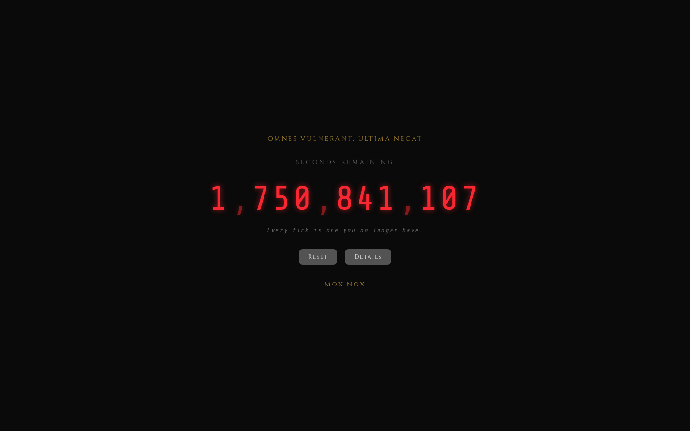

# Death Clock

<p align="center"></p>

A web application inspired by the [Vsauce Death Clock](https://inqfactory.com/pages/death-clock) by Inq Factory.
It estimates the seconds you have left to live based on a detailed lifestyle & health survey, then counts them down in real-time on a seven-segment-style display.

> *OMNES VULNERANT, ULTIMA NECAT* — "All wound, the last kills."



## How It Works

1. **Survey** — Answer 18 questions across 6 categories: Basics, Body, Fitness, Health Markers, Lifestyle, and Family History.
2. **Estimate** — The backend starts from a WHO-style baseline life expectancy for your country & sex, then applies 15 evidence-based modifier factors (±years).
3. **Countdown** — The frontend ticks down every second, showing the total remaining seconds (e.g. `1,234,567,890`). Every second that passes is one you no longer have.

## Tech Stack

| Layer    | Technology                          |
|----------|-------------------------------------|
| Backend  | FastAPI + SQLAlchemy + aiosqlite    |
| Database | SQLite (stored in a Docker volume)  |
| Frontend | Vanilla HTML / CSS / JS (no build)  |
| Container| `uv` + Python 3.13 slim image       |

## Quick Start

```bash
cd /stacks/death
docker compose up -d --build
```

The app will be available at **http://localhost:8003**.

### Default User (Auto-Seed)

On first startup (empty database), the app automatically seeds a default
profile (see `app/seed.py`), so the clock appears immediately without
any form interaction. The seed runs only if no profile exists yet — if you
reset or submit a new survey, the new data replaces the seed.

To reset back to the seed after a change: delete the Docker volume and
restart.

```bash
docker compose down -v   # removes the volume
docker compose up -d      # re-seeds on startup
```

## Lifespan Estimation Algorithm

The estimation is a **heuristic**, not a medical prediction:

1. **Baseline**: Life expectancy by country & sex from an embedded WHO-style table (~40 countries, falls back to global average).
2. **15 Modifier Factors** (each adds or subtracts years, with a human-readable explanation):

   | Factor                | Logic                                                                                      |
   |-----------------------|--------------------------------------------------------------------------------------------|
   | **BMI**               | Optimal (18.5–25): +1.0, overweight: −0.5, obese: −3.0 to −6.0                           |
   | **Exercise Volume**   | Frequency × intensity matrix, up to +4.5 for 5-6×/week intense, −2.5 for sedentary        |
   | **Cardio Fitness**    | Self-rated: low −1.0, moderate +0.5, high +1.5, elite +2.0                               |
   | **Education**         | Secondary −0.5 to doctorate +1.5 (health literacy proxy)                                 |
   | **Blood Pressure**    | Normal +1.0, elevated −0.5, high −3.0, unknown 0                                        |
   | **Cholesterol**       | Normal +0.5, elevated −1.0, high −2.5, unknown 0                                        |
   | **Blood Glucose**     | Normal +0.5, prediabetic −1.5, diabetic −4.0, unknown 0                                 |
   | **HRV (RMSSD)**       | <20 ms: −1.0, 40–60: +1.0, 60–80: +1.5, 80+: +2.0, unknown 0                           |
   | **Resting HR**        | <50 bpm: +1.5, 60–70: +0.5, 80+: −2.5, unknown 0                                       |
   | **Smoking**           | Never +0.5, former light (quit 5y+): −0.3, current heavy: −7.0                         |
   | **Alcohol**           | None +0.5, rare 0, moderate −1.0, heavy −3.5                                            |
   | **Sleep**             | 7–8.5h: +1.0, 6–9.5h: 0, else −1.5 to −3.0                                             |
   | **Stress**            | Low +1.0, medium −0.5, high −2.5                                                       |
   | **Diet**              | Mediterranean +2.0, balanced +1.0, average 0, poor −2.0                               |
   | **Family History**    | None +0.5, minor −0.5, significant −2.5                                               |

3. **Hard ceiling**: 100 years — even with optimal factors, individual life expectancy without major medical breakthroughs doesn't realistically exceed this.
4. **Death date** = birth date + adjusted life expectancy in days.

## Project Structure

```
/stacks/death/
├── compose.yml          # Docker Compose service definition
├── Dockerfile           # uv + Python 3.13 slim image
├── pyproject.toml       # Python dependencies
├── generate_icon.py     # Generates apple-touch-icon.png at build time
├── .gitignore
├── README.md
├── app/
│   ├── __init__.py
│   ├── main.py          # FastAPI app & routes
│   ├── db.py            # SQLAlchemy async models & session
│   ├── models.py        # Pydantic request/response schemas
│   ├── lifespan.py      # 15-factor life-expectancy estimation engine
│   └── seed.py          # Default profile auto-seed on first run
└── static/
    ├── index.html       # Sectioned survey form + clock display
    ├── style.css        # Dark theme, seven-segment styling, form sections
    ├── app.js           # Countdown logic, dynamic factor breakdown
    ├── favicon.svg       # Skull favicon
    └── apple-touch-icon.png  # Generated at Docker build time
```

## API Endpoints

| Method | Path               | Description                              |
|--------|--------------------|------------------------------------------|
| POST   | `/api/survey`      | Submit survey, get estimate + factors    |
| GET    | `/api/profile`     | Retrieve the single stored profile       |
| DELETE | `/api/profile`     | Delete stored profile (reset)            |
| GET    | `/`                | Serve the frontend                       |
| GET    | `/docs`            | Auto-generated FastAPI Swagger docs      |

## Features

- 🕐 **Real-time countdown** — ticks every second, runs entirely client-side after initial estimate
- 🔢 **Seconds display** — shows the full remaining seconds with thousands separators
- 📊 **Detailed factor breakdown** — 15 evidence-based factors, each with a years delta and human-readable explanation
- 🏷️ **Summary boxes** — baseline → adjustment → adjusted life expectancy at a glance
- 🎨 **Seven-segment aesthetic** — glowing red digits with `Share Tech Mono` font
- ⚜️ **Latin mottos** — *OMNES VULNERANT, ULTIMA NECAT* and *MOX NOX*
- 🍂 **Patina effect** — subtle CSS hue-shift over time, inspired by the corten steel edition
- 🔒 **Server-side persistence** — profile stored in SQLite, shared across all devices
- 🌱 **Auto-seed** — default profile loaded on first startup, clock shows immediately
- 💀 **Skull favicon** — SVG + generated PNG for iOS home screen

## Disclaimer

This project is a *memento mori* — a reminder that time is fleeting, meant to inspire you to seize the day. The lifespan estimate is a rough heuristic based on population averages and lifestyle factors. **It is not a medical prediction.**

If you find yourself preoccupied with thoughts of death, please seek help:
[findahelpline.com](https://findahelpline.com)

## License

MIT — do whatever you want with it.